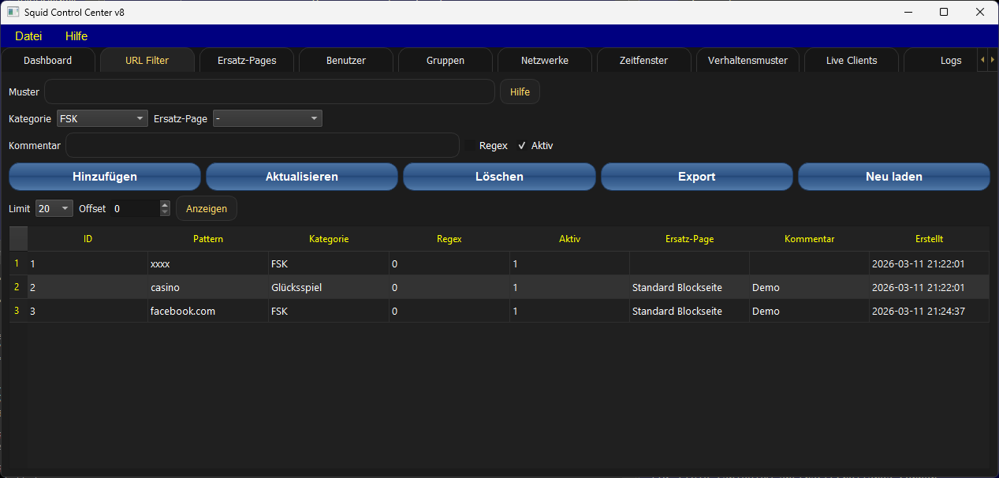

# squid_control
Tool for manage Squid-Proxy
 
To start the Application you need Python 3.13.12 
For install this version you can use the Microsoft Windows 11 PowerShell Script named setup.ps1.
If you have problems by starting this script, you can try to exec it by call the setup.bat batch
file on the Command Line Interface (CLI) - the Windows Console.
You use it at your own risk - no support.

Check the release section on the middle right side of github.com at this repository.
The Pictures can be out of date.
They may don't give the correct state of the project - I'll try to keep them up to date.

Preview Setup A

